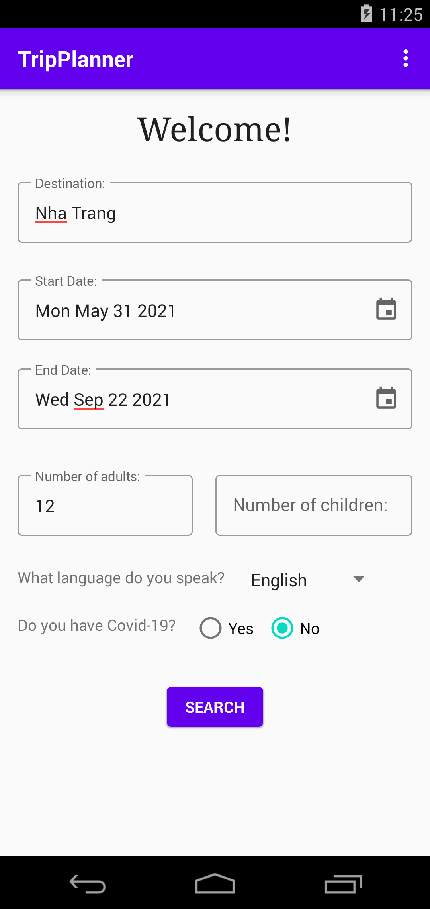

# GymLazyTripPlanner
This is the Android app that was built for the purpose of planning a trip. During the development process, all the basic concepts such as activities, fragments, widgets, AsyncTask, database operations, services, content provider and many more were implemented for the application

Screenshots of the app:

    
    

 
  

